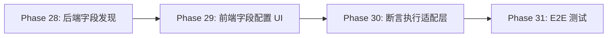

# Roadmap: aiDriveUITest v0.4.1

**Milestone:** 断言系统调通
**Goal:** 修正断言系统的参数结构，支持三层参数配置
**Phases:** 4 | **Requirements:** 12

---

## Phase Overview

| # | Phase | Goal | Requirements | Success Criteria |
|---|-------|------|--------------|------------------|
| 28 | 后端字段发现 | Complete | FLD-01, FLD-02, FLD-03 | 2026-03-22 |
| 29 | 前端字段配置 UI | 3/3 | Complete    | 2026-03-22 |
| 30 | 断言执行适配层 | 3/3 | Complete   | 2026-03-22 |
| 31 | E2E 测试 | Mock ERP 端到端验证完整断言流程 | E2E-01, E2E-02 | 2 |

---

## API Contract (关键设计决策)

### Request Body (前端 -> 后端)

```json
{
  "class_name": "PcAssert",
  "method_name": "attachment_inventory_list_assert",
  "data": "main",
  "api_params": {
    "i": 1,
    "j": null,
    "headers": "main"
  },
  "field_params": {
    "statusStr": "已完成",
    "createTime": "now"
  }
}
```

### Response (后端 -> 前端)

```json
{
  "success": true,
  "passed": false,
  "duration": 1.23,
  "fields": [
    {"name": "statusStr", "expected": "已完成", "actual": "进行中", "passed": false},
    {"name": "createTime", "expected": "now", "actual": "2026-03-21 10:30:00", "passed": true}
  ],
  "error": null
}
```

---

## Phase 28: 后端字段发现

**Goal:** AST 解析 base_assertions_field.py，提供可用断言字段列表 API

**Requirements:**
- FLD-01: 使用 AST 解析 param 字典，提取所有字段
- FLD-02: API 端点 GET /api/external-assertions/fields 返回字段列表
- FLD-03: 字段列表包含 name, path, is_time_field, group

**Plans:** 2/2 plans complete

| Plan | Objective | Wave | Requirements |
|------|-----------|------|--------------|
| 28-01 | AST Parser + Field Discovery | 1 | FLD-01 |
| 28-02 | API Endpoint + Tests | 2 | FLD-02, FLD-03 |

**Technical Approach:**

1. **AST 解析** (避免运行时依赖 BaseApi)
   ```python
   import ast

   def parse_assertions_field_py(file_path: str) -> list[dict]:
       with open(file_path) as f:
           tree = ast.parse(f.read())

       # Find param = {...} assignment in assertive_field method
       # Extract all keys and their tuple values
   ```

2. **字段分组策略** (从命名模式推断)
   - `sale*` -> 销售相关
   - `purchase*` -> 采购相关
   - `*Time` / `*time` -> 时间字段
   - `accessoryOrderInfo.*` -> 配件订单嵌套
   - 其他 -> 通用字段

3. **description 生成** (从字段名自动生成)
   ```python
   def generate_description(field_name: str) -> str:
       # createTime -> "创建时间"
       # statusStr -> "状态"
       # salesOrder -> "销售订单"
   ```

**Success Criteria:**
1. GET /api/external-assertions/fields 返回 JSON 字段列表
2. 字段列表包含 name, path, is_time_field, group, description
3. 字段数量 ~300，与 base_assertions_field.py 一致
4. 分组合理，前端可按分组展示
5. 单元测试：验证 AST 解析器正确提取所有字段

**Key Files:**
- `backend/core/external_precondition_bridge.py` - 扩展字段解析函数
- `backend/api/routes/external_assertions.py` - 新增字段列表端点
- `backend/tests/unit/test_assertions_field_parser.py` - 单元测试
- `backend/tests/api/test_external_assertions_api.py` - 集成测试 (扩展)

---

## Phase 29: 前端字段配置 UI

**Goal:** AssertionSelector 支持三层参数配置（data、api_params、field_params）

**Requirements:**
- UI-01: 断言配置弹窗分为三个区域：data 选择、api_params、field_params
- UI-02: field_params 支持按分组浏览、搜索字段（300+ 字段）
- UI-03: 时间字段值输入有 "now" 快捷按钮
- UI-04: 支持添加/删除多个字段配置

**Plans:** 3/3 plans complete

| Plan | Objective | Wave | Requirements |
|------|-----------|------|--------------|
| 29-01 | Type Extensions + API Client | 1 | UI-01, UI-02 |
| 29-02 | FieldParamsEditor Component | 2 | UI-02, UI-03, UI-04 |
| 29-03 | AssertionSelector Integration | 3 | UI-01, UI-04 |

Plans:
- [x] 29-01-PLAN.md — Extend types and add listFields() API
- [x] 29-02-PLAN.md — Create FieldParamsEditor with grouping, search, "now" button
- [x] 29-03-PLAN.md — Integrate FieldParamsEditor into AssertionSelector

**UI Layout:**

```
+---------------------------------------------+
| 断言配置                                      |
+---------------------------------------------+
| 1. 查询方法 (data)                           |
|    [main v] 主数据                           |
+---------------------------------------------+
| 2. API 筛选参数 (api_params)                 |
|    i: [v 选择]                               |
|    j: [v 选择]                               |
|    headers: [main v]                         |
+---------------------------------------------+
| 3. 断言字段 (field_params)                   |
|    [+ 添加字段]                               |
|    +-------------------------------------+  |
|    | [搜索字段...]          [按分组 v]   |  |
|    +-------------------------------------+  |
|    | 销售相关 (15)                        |  |
|    |   [x] salesOrder  [SA____]           |  |
|    |   [x] saleTime     [now v]           |  |
|    | 时间字段 (20)                        |  |
|    |   [x] createTime   [now v]           |  |
|    +-------------------------------------+  |
+---------------------------------------------+
```

**"now" 语义:**
- 用户点击 "now" 按钮 -> 输入框填入字符串 "now"
- 后端收到 "now" -> 调用 get_formatted_datetime() 生成当前时间
- 断言时用 datetime.now() +/- 1分钟范围校验

**Success Criteria:**
1. 三个配置区域清晰分离
2. 字段列表按分组展示，支持搜索
3. 时间字段有 "now" 快捷按钮
4. 可添加/删除多个字段
5. 组件级测试：搜索、筛选、添加/删除

**Key Files:**
- `frontend/src/components/TaskModal/AssertionSelector.tsx` - 重构为三区域布局
- `frontend/src/components/TaskModal/FieldParamsEditor.tsx` - 新增字段配置组件
- `frontend/src/types/index.ts` - 更新类型定义
- `frontend/src/api/externalAssertions.ts` - 添加 listFields() API

---

## Phase 30: 断言执行适配层

**Goal:** 适配层模式处理三层参数传递，返回结构化结果

**Requirements:**
- EXEC-01: execute_assertion_method() 接收三层参数结构
- EXEC-02: 适配层将 field_params 中的 "now" 转换为实际时间
- EXEC-03: 捕获 AssertionError，解析为结构化字段结果

**Plans:** 3/3 plans complete

| Plan | Objective | Wave | Requirements |
|------|-----------|------|--------------|
| 30-01 | Adapter Layer Implementation | 1 | EXEC-01, EXEC-02, EXEC-03 |
| 30-02 | API Endpoint | 2 | EXEC-01, EXEC-02, EXEC-03 |
| 30-03 | Test Coverage | 3 | EXEC-01, EXEC-02, EXEC-03 |

Plans:
- [x] 30-01-PLAN.md — Implement adapter layer in external_precondition_bridge.py
- [x] 30-02-PLAN.md — Add POST /execute API endpoint
- [x] 30-03-PLAN.md — Add/update unit tests for three-layer params, "now" conversion, backward compatibility

**Technical Approach:**

1. **不修改 base_assert.py**，在适配层处理：

   ```python
   async def execute_assertion_method(
       class_name: str,
       method_name: str,
       headers: str | None = 'main',
       data: str = 'main',
       api_params: dict | None = None,      # NEW
       field_params: dict | None = None,    # NEW
       params: dict | None = None,          # Keep for backward compat
       timeout: float = 30.0
   ) -> dict:
       # Backward compatibility
       if params and not field_params:
           field_params = params

       # Merge params
       kwargs = {**(api_params or {}), **(field_params or {})}

       # Convert "now" to datetime strings
       kwargs = _convert_now_values(kwargs)

       # Execute with timeout
       try:
           assertion_method(data=data, **kwargs)
           return {"success": True, "passed": True, "fields": []}
       except AssertionError as e:
           return {"success": True, "passed": False, "fields": _parse_assertion_error(str(e))}
   ```

2. **"now" 转换函数**:
   ```python
   def _convert_now_values(kwargs: dict) -> dict:
       result = {}
       for key, value in kwargs.items():
           if value == 'now' and _is_time_field(key, None):
               result[key] = datetime.now().strftime('%Y-%m-%d %H:%M:%S')
           else:
               result[key] = value
       return result
   ```

3. **响应结构统一** (D-04):
   - 修改 `_parse_assertion_error()` 返回 `name` 而非 `field`
   - 响应使用 `fields` 而非 `field_results`

**Success Criteria:**
1. Three-layer params correctly passed to assertion method
2. "now" values correctly converted to datetime strings
3. AssertionError parsed into structured field results with `name` field
4. Response uses `fields` key (not `field_results`)
5. Backward compatibility maintained (params as field_params fallback)
6. All unit tests pass

**Key Files:**
- `backend/core/external_precondition_bridge.py` - Refactor execute_assertion_method, add _convert_now_values
- `backend/api/routes/external_assertions.py` - Add POST /execute endpoint
- `backend/tests/unit/test_external_assertion_bridge.py` - New test classes
- `backend/tests/core/test_external_precondition_bridge_assertion.py` - Updated tests

---

## Phase 31: E2E 测试

**Goal:** Mock ERP 端到端验证完整断言流程

**Requirements:**
- E2E-01: 完整断言流程测试（配置 -> 执行 -> 结果展示）
- E2E-02: 测试断言成功和断言失败两种场景

**Mock Strategy:**
- Mock ERP API 响应（不依赖真实 ERP）
- Mock LoginApi.headers 返回测试 token

**Success Criteria:**
1. E2E 测试不依赖真实 ERP 系统
2. 测试覆盖：选择断言 -> 配置三层参数 -> 执行 -> 查看结果
3. 测试断言成功场景（所有字段通过）
4. 测试断言失败场景（部分字段失败，展示预期/实际值）
5. 所有 E2E 测试通过

**Key Files:**
- `e2e/assertion-flow.spec.ts` - E2E 测试
- `e2e/mocks/erp-api.ts` - Mock ERP 响应

---

## Dependencies



---

## Test Strategy

| Phase | Unit Tests | Integration Tests | E2E Tests |
|-------|------------|-------------------|-----------|
| 28 | AST 解析器 | API 端点 | - |
| 29 | 组件渲染 | - | - |
| 30 | 参数传递、结果序列化 | 完整执行流程 | - |
| 31 | - | - | Mock ERP |

---

*Roadmap created: 2026-03-21*
*Last updated: 2026-03-22 - Phase 30 plans created*
